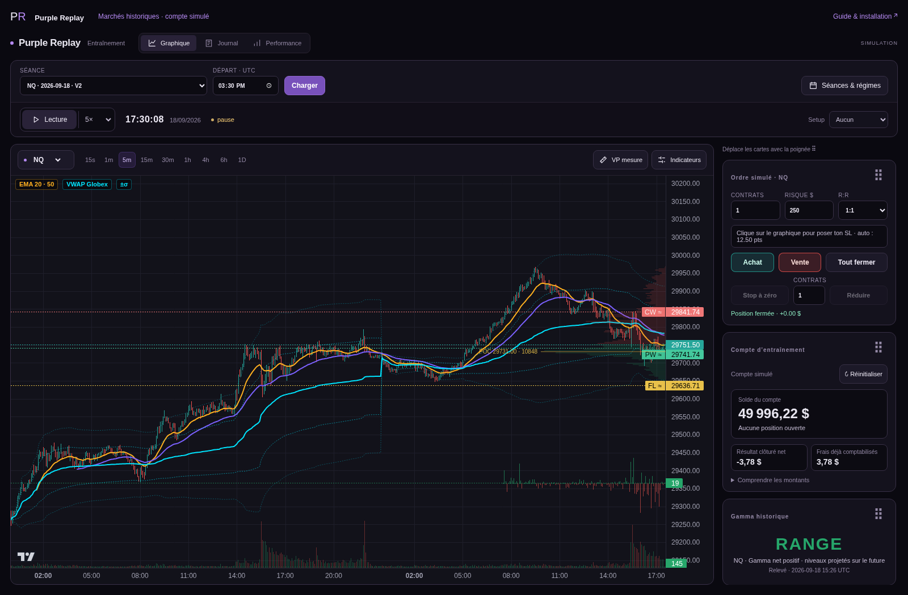

# PurpleChart Showcase — Purple Replay 1.2.0

**Démo Docker d’entraînement : Go + Python + PostgreSQL, interface Svelte/TypeScript.**
Rejouez des séances historiques, passez des ordres simulés et consultez votre journal.
Aucune clé API, aucun compte Topstep et aucune connexion à un broker ne sont nécessaires.



## Technologies réellement utilisées

| Technologie | Rôle dans cette démo |
|---|---|
| **Go** | Service `market` : lit les ticks historiques dans PostgreSQL et fournit les lots au moteur Python. Préserve tous les ticks partageant le dernier timestamp d’un lot. |
| **Python / FastAPI** | API HTTP/WebSocket, horloge de replay, calculs, ordres simulés, journal et performances. Interroge aussi PostgreSQL pour le contexte historique et les bougies. |
| **PostgreSQL 17** | Stocke les ticks et niveaux gamma importés, les trades simulés, les échantillons de performance, les séances sauvegardées et les points de reprise. Volume Docker persistant. |
| **Svelte / TypeScript** | Interface, graphiques et interactions. Compilés avec Vite ; Node intervient uniquement au build. |
| **nginx / Docker Compose** | Point d’accès local et orchestration des services isolés. |
| SQLite | **Format de transport des archives de marché uniquement dans Docker** : importé au premier lancement. Les adaptateurs SQLite restent disponibles pour les tests unitaires et le développement hors Docker. |

Le V2 privé utilise Go pour la collecte live. **Cette édition publique utilise un service Go historique dédié**, sans reprendre le connecteur Topstep/ProjectX. Elle présente une architecture multilangage fonctionnelle, pas une copie intégrale du V2 de production. La version 1.1.0 utilisait Python/SQLite ; 1.2.0 introduit réellement Go/PostgreSQL.

## Installation avec les séances

Téléchargez le paquet complet depuis la [release 1.2.0](https://github.com/Mr-yums/PurpleChart-showcase/releases/tag/v1.2.0), ainsi que `SHA256SUMS`.
Le ZIP automatique « Source code » de GitHub ne contient pas les bases de marché.

```sh
sha256sum -c SHA256SUMS
tar -xzf purple-replay-1.2.0.tar.gz
cd purple-replay
docker compose up -d --build
```

Ouvrez **http://127.0.0.1:8948/**. Si ce port est occupé :

```sh
PURPLE_REPLAY_PORT=18948 docker compose up -d --build
```

Le premier démarrage télécharge les images/dépendances puis importe les archives dans PostgreSQL. L’interface démarre après cet import ; comptez plusieurs minutes selon votre disque et processeur. Les archives représentent environ 4,5 Go, auxquels s’ajoutent PostgreSQL, ses index, son journal transactionnel et les images : prévoir **au moins 20 Go libres**. Le paquet complet contient 32 623 604 ticks sur huit symboles, avec des périodes de couverture différentes.

```sh
docker compose logs -f import-market
# Contrôle des services après import
docker compose ps
python scripts/check-install.py http://127.0.0.1:8948
```

L’import est transactionnel par archive. Une interruption annule l’archive en cours ; la suivante reprend au redémarrage. Les archives déjà importées sont reconnues par empreinte. Si le contenu distribué change, l’import refuse de remplacer silencieusement une base existante.

## Utilisation et persistance

1. Choisir un instrument et une séance, puis charger le replay.
2. Lire, mettre en pause, changer la vitesse et examiner les graphiques.
3. Placer et clôturer des ordres **simulés** ; consulter journal et performances.
4. Sauvegarder une séance et reprendre ultérieurement depuis le même navigateur.

Chaque navigateur reçoit un espace indépendant par cookie. Effacer ce cookie change l’espace visible ; ce mécanisme n’est pas une authentification destinée à un service Internet partagé.
Les séances sauvegardées, trades clôturés et points de reprise sont persistants. Une reprise redémarre en pause ; il ne s’agit pas de restaurer un ordre broker ou de garantir la restauration d’une position encore ouverte.

```sh
docker compose stop        # arrêt, données conservées
docker compose start       # relance de l’installation initialisée
docker compose down        # retire les conteneurs, conserve les volumes
# ATTENTION : down -v efface aussi PostgreSQL et tous les exercices de cette installation.
```

**Migration 1.1 → 1.2 :** utiliser un dossier distinct et un nom de projet distinct (`docker compose -p purple-replay-v12 up -d --build`). Les anciens journaux SQLite/JSONL ne sont pas importés automatiquement. Garder l’ancienne installation et ses volumes pour conserver ces exercices. Ne jamais monter la base privée de PurpleChart dans cette démo.

## Isolation et absence de broker

- Aucun connecteur Topstep/ProjectX, aucune route de passage d’ordre réel, aucune clé API à fournir.
- Archives publiques reconstruites : données de marché sélectionnées, pas de comptes ni d’anciens trades personnels, pas d’événements de stratégie privée.
- Go, Python et PostgreSQL sont sur un réseau Docker interne ; aucun de leurs ports n’est publié directement. Seul nginx publie le port sur **127.0.0.1**.
- Go et les lectures Python utilisent un rôle PostgreSQL en lecture seule sur le marché ; le journal utilise un rôle distinct limité aux tables de simulation. Seul le conteneur d’import éphémère utilise le rôle d’administration.
- Les mots de passe `demo-*` dans Compose/SQL sont des valeurs publiques réservées à cette installation locale isolée, **pas des secrets personnels**. Ne pas exposer cette configuration sur Internet.
- Le navigateur charge les ressources de l’instance (CSP same-origin). Aucun suivi analytique. Le lien de téléchargement mène à GitHub lorsque vous le choisissez.

Le téléchargement et le build nécessitent Internet. Après installation, le replay utilise les données locales ; le test d’isolation vérifie l’absence de route Internet des services internes. Cela ne constitue pas une garantie universelle contre toute vulnérabilité.

## Vérifications et développement

```sh
python -m venv .venv
.venv/bin/pip install -r replay/backend/requirements-dev.txt
npm ci --prefix frontend
scripts/check
(cd market-go && go test -race ./...)
```

La CI génère un petit marché **synthétique** pour vérifier Docker sans télécharger le paquet complet. Elle teste aussi Go/PostgreSQL, les restrictions des rôles, le parcours navigateur et l’absence de requêtes externes. Les tests Python unitaires conservent SQLite comme fixture rapide ; leur réussite seule ne valide pas le déploiement PostgreSQL.

Architecture détaillée : [docs/ARCHITECTURE.md](docs/ARCHITECTURE.md). Guide intégré : `/guide.html`.

## Limites

Simulation à partir de ticks enregistrés : interruptions de collecte conservées, pas de reconstitution de carnet complet ni de garantie d’exécution ou de latence réelle. Frais et remplissages sont ceux du simulateur. Les niveaux gamma disponibles sont historiques et limités à leur couverture. US500 n’est pas inclus. Les profils du catalogue sont rétrospectifs.

Projet de **Mr.yums**. Code sous licence [MIT](LICENSE) ; cette licence du code ne prétend pas accorder des droits supplémentaires sur des données de marché tierces.
