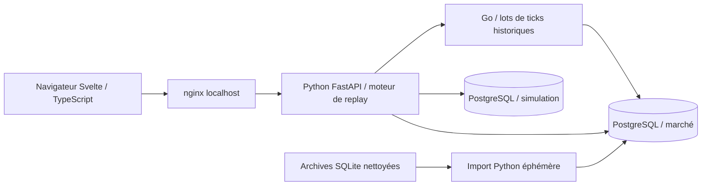

# Architecture de Purple Replay 1.2.0

## Parcours d’une séance

Python fait avancer l’horloge propre à chaque visiteur. Son lecteur précharge les lots via le service Go interne. Go lit les ticks de PostgreSQL avec un curseur temporel strict et `FETCH FIRST ... WITH TIES` : tous les ticks du dernier instant sont inclus, même si cela dépasse la taille nominale du lot. Il valide source, symbole, borne finie et taille maximale. Il n’a aucun client broker ni mode live.

Python lit également les agrégats de marché dans PostgreSQL pour amorcer les bougies, volumes et contexte. Le moteur et les ordres restent en Python. Le service Go historique est propre à la Showcase ; le collecteur live du V2 privé n’est pas distribué.

## Stockage

| Schéma / support | Contenu | Écriture |
|---|---|---|
| PostgreSQL `legacy`, `modern` | `tape_trades`, `replay_symbols`, `gex` | Import initial uniquement |
| PostgreSQL `simulation.records` | Trades simulés, séances sauvegardées, détails et échantillons de performance | Rôle `replay_writer` |
| PostgreSQL `simulation.documents` | Point de reprise par espace navigateur | Rôle `replay_writer` |
| PostgreSQL `public.market_imports` | Empreintes et nombre de ticks de chaque import | Import uniquement |
| Fichiers `/market` | Archives d’import SQLite et catalogues JSON publics | Montage lecture seule |
| Volume `/state` | Répertoires de visiteurs et caches de catalogues | Python ; aucune dépendance à ces caches pour les journaux PostgreSQL |

Toutes les requêtes de simulation filtrent l’espace visiteur et le type de document. Ce filtrage applicatif n’est pas une politique PostgreSQL RLS. Les cookies servent d’identifiants d’espace local, pas de comptes authentifiés. Le pool Python est partagé et borné ; il ne crée pas une connexion permanente pour chaque visiteur/thread.

Les adaptateurs SQLite/JSONL restent dans les sources pour tests et développement sans PostgreSQL. Compose définit explicitement les DSN PostgreSQL : aucune bascule silencieuse vers SQLite en cas de panne. Les erreurs de dépendance doivent être visibles.

## Import et redémarrage

L’import lit seulement les colonnes de marché autorisées des trois archives. Il ne copie ni table de comptes, ni événements de stratégie, ni trades personnels. Une transaction couvre chaque archive et ses index ; le marqueur n’est écrit qu’une fois l’import complet. Un verrou PostgreSQL empêche deux imports concurrents. Les empreintes incluent ticks et gamma ; un volume contenant un autre jeu de données est refusé, pas écrasé.

Compose attend : PostgreSQL sain → import terminé → Go sain → Python sain → nginx. Le contrôle `/api/health` vérifie réellement PostgreSQL et Go et annonce `market=postgresql`, `ticks=go`, `journal=postgresql`. Le volume PostgreSQL conserve les exercices après retrait/recréation des conteneurs. `down -v` est destructif. Les journaux 1.1.0 ne sont pas migrés automatiquement.

## Séparation du code

- `market-go/` : serveur HTTP Go, requête de ticks, validation et tests.
- `database/` : schémas, rôles et droits initiaux PostgreSQL.
- `scripts/import-market.py` : import strict et transactionnel.
- `replay/backend/app/domain/` : calculs et états du simulateur.
- `replay/backend/app/services/` : orchestration des fonctionnalités.
- `replay/backend/app/repositories/` : adaptateurs PostgreSQL, Go, et adaptateurs locaux de tests.
- `replay/backend/app/infra/` : pools, connexions et diffusion.
- `replay/backend/app/bootstrap.py` : assemblage par espace visiteur.
- `replay/backend/app/api/` : transport HTTP/WebSocket.
- `replay/frontend/lib/` : domaine TypeScript, stores et composants Svelte.
- `frontend/` : entrée et build Vite.

Les couches et l’absence de cycles Python sont testées. Ce découpage ne constitue pas une certification SOLID.

## Réseau et permissions

PostgreSQL, import, Go et Python sont sur un réseau interne. nginx est relié à ce réseau et au réseau frontal ; son proxy a une destination fixe et son IP forwarding est désactivé. Seul son port localhost est publié. Le navigateur a une CSP same-origin et un contrôle Host/origine. Les images applicatives sont sans privilège, en lecture seule, sans capacités Linux ; PostgreSQL conserve les permissions nécessaires à son entrypoint et à son volume.

`market_reader` peut lire le marché mais ne peut ni le modifier ni lire les journaux. `replay_writer` peut écrire les exercices mais ne peut pas lire le marché. Le rôle administrateur est réservé à PostgreSQL et au conteneur d’import terminé. Les mots de passe de démonstration sont publics et locaux, sans lien avec les secrets du V2 privé.

Les builds téléchargent les dépendances ; le fonctionnement historique ne dépend d’aucun fournisseur. Les images de base utilisent certains tags : une reconstruction bit à bit n’est pas garantie.

## Vérification

Tests unitaires Python/TypeScript et Go ; tests d’intégration contre PostgreSQL réel : parité avec archives, gamma, lots Go avec timestamps identiques, permissions des rôles, persistance et séparation des espaces. Parcours navigateur : chargement, lecture/pause, ordre/clôture, journal, sauvegarde, performance et responsive. Test de redémarrage pour le journal et le point de reprise. Les fixtures CI sont synthétiques ; le paquet complet doit aussi être vérifié sur les archives distribuées.
